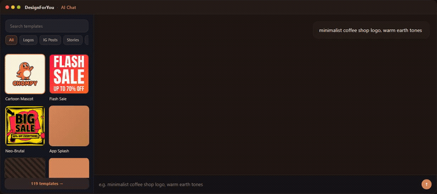

# DesignForYou — MCP server

[](https://www.npmjs.com/package/designforyou-mcp)
[](https://registry.modelcontextprotocol.io/v0/servers?search=designforyou)
[](./LICENSE)

Generate **logos, social posts, app-store screenshots, comic panels, and
visual-novel assets** from natural-language prompts — directly inside Claude
Code, Grok, Codex, Cursor, OpenCode, ChatGPT, or any MCP client.

DesignForYou is an MCP-native design generator backed by 119 templates. Browse
and recommend tools are free; generation is metered per user (50 free credits on
sign-up).

## Demo



*Describe what you want → the agent picks a template and generates a finished
design. Logos, Instagram posts, app-store screenshots, and more.*

| | |
|---|---|
| **Website** | https://designforyou.swapp1990.org |
| **Connect (human)** | https://designforyou.swapp1990.org/connect |
| **Agent guide (plain text)** | https://designforyou.swapp1990.org/.well-known/mcp/connect.md |
| **MCP URL** | `https://designforyou.swapp1990.org/mcp/v2/` (trailing slash required) |
| **Privacy** | https://designforyou.swapp1990.org/privacy |

## Auth

| Path | What you do | Who stores secrets |
|------|-------------|--------------------|
| **OAuth (primary)** | Complete browser sign-in when the client prompts | **The MCP client** |
| **Long-lived token (fallback)** | Sign in on the website → Generate on `/connect` → `DESIGNFORYOU_MCP_TOKEN` | **You** (env / header) |

OAuth is the normal path. PAT minting is only for Codex, headless agents, or when OAuth stays “disabled / not connected.” Full recipes: [CONNECT.md](./CONNECT.md) or the live well-known guide above.

## Install

### Claude Code (recommended)

```bash
claude mcp add --transport http designforyou https://designforyou.swapp1990.org/mcp/v2/
claude mcp login designforyou
```

Approve the browser sign-in when prompted.

### Grok

```bash
grok mcp add --transport http designforyou https://designforyou.swapp1990.org/mcp/v2/
```

Then `/mcps` → `designforyou` → `i` (authorize) → browser → `r`.

### OpenCode

Add a remote MCP entry for the URL above, then:

```bash
opencode mcp auth designforyou
opencode mcp list
```

### Codex (bearer fallback)

1. Generate a token at https://designforyou.swapp1990.org/connect  
2. Store as `DESIGNFORYOU_MCP_TOKEN`  
3. Configure:

```powershell
codex mcp add designforyou --url https://designforyou.swapp1990.org/mcp/v2/ --bearer-token-env-var DESIGNFORYOU_MCP_TOKEN
```

### Cursor

[](cursor://anysphere.cursor-deeplink/mcp/install?name=designforyou&config=eyJ1cmwiOiJodHRwczovL2Rlc2lnbmZvcnlvdS5zd2FwcDE5OTAub3JnL21jcC92Mi8ifQ==)

Or `.cursor/mcp.json`:

```json
{
  "mcpServers": {
    "designforyou": {
      "url": "https://designforyou.swapp1990.org/mcp/v2/",
      "transport": "http"
    }
  }
}
```

### VS Code

[](https://insiders.vscode.dev/redirect/mcp/install?name=designforyou&config=%7B%22url%22%3A%22https%3A%2F%2Fdesignforyou.swapp1990.org%2Fmcp%2Fv2%2F%22%7D)

### Claude Desktop / stdio shim

```bash
npx -y designforyou-mcp
```

Or native HTTP in `claude_desktop_config.json` with the `/mcp/v2/` URL. Complete OAuth when prompted.

## Tools

| Tool | Cost | What it does |
|------|------|--------------|
| `browse_templates` | free | Browse the 119-template catalog (filter by category) |
| `recommend_template` | free | Recommend the best templates for a described use case |
| `get_text_fields` | free | List a template's editable text fields |
| `get_credits` | free | Check your credit balance |
| `generate` | paid | Generate a finished design from a template + description |
| `generate_variations` | paid | Generate style variations of a template |
| `edit_text` | paid | Edit text on an existing design |
| `vn_generate_sprite_sheet` | paid | Generate a visual-novel character sprite sheet |

## Example prompts

- *"Browse logo templates on DesignForYou."*
- *"I'm opening a coffee shop called NEXUS — minimalist, warm earth tones. Make me a logo."*
- *"Generate an Instagram post announcing a 20%-off flash sale for a vegan bakery."*
- *"Create an app-store screenshot for a meditation app, calm gradient background."*

## How it works

DesignForYou exposes a remote MCP server (Streamable HTTP). On the first paid
tool call (or when you run `mcp login` / `mcp auth`), your client discovers the
OAuth flow (RFC 9728 protected-resource metadata → Supabase with Dynamic Client
Registration), opens a browser for sign-in + consent, and stores tokens.
Generation is metered against your credit balance; top up on the website.

This repository is the public home for install docs and the MCP `server.json`.
The product itself is a hosted service — there is no self-host package.

## Links

- App: https://designforyou.swapp1990.org  
- Connect: https://designforyou.swapp1990.org/connect  
- Agent guide: https://designforyou.swapp1990.org/.well-known/mcp/connect.md  
- [Official MCP Registry](https://registry.modelcontextprotocol.io/v0/servers?search=designforyou) as `org.swapp1990.designforyou/designforyou`
